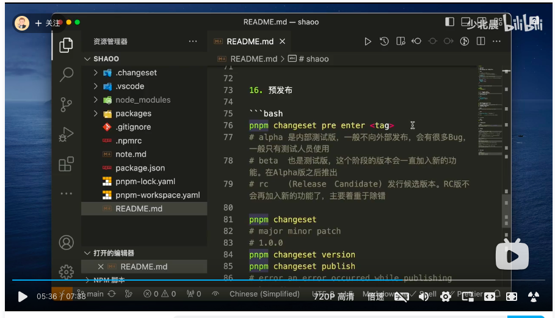

1.npm init
2.修改package.json文件,包管理器限制

```json
 "private": true, // 私有包，只能在当前项目中使用
  "scripts": {
    "preinstall": "npx only-allow pnpm",  
  },
```
3.手动添加pnpm-workspace.yaml文件

```yaml
packages:
  - 'packages/*'
```

4.创建packages文件夹，并在其中创建子文件夹，如：

```
packages
├── package1
│   ├── src
│   │   └── index.ts
│   └── package.json
├── package2
│   ├── src
│   │   └── index.ts
│   └── package.json
└── package3
    ├── src
    │   └── index.ts
    └── package.json
```
5.修改子包的package.json文件

```json
"publishConfig": {d f s d
    "access": "public"
  },
```
子包名名字：@mote/test-share，@mote/test
6.在test目录下执行：
```bash
pnpm -F @mote/test add @mote/test-share // 安装报错了
# pnpm i @mote/test-share --filter test 
```
7.登陆npm
```bash
npm login
```

8.安装包依赖,根目录下执行：
```bash
pnpm i @changesets/cli -Dw
pnpm changeset init
```


9.预发布
```bash
pnpm changeset pre enter <tag>
# alpha 是内部测试版本，一般不向外部发布，会有很多bug
# beta 是公开测试版本，这个版本会加入一些新功能，在alpha版之后推出
# rc 是发行候选版本，不会再加入新的功能
pnpm changeset
pnpm changeset version
pnpm changeset publish
```
10.正式发布
```bash
pnpm changeset
pnpm changeset version
pnpm changeset publish
```
